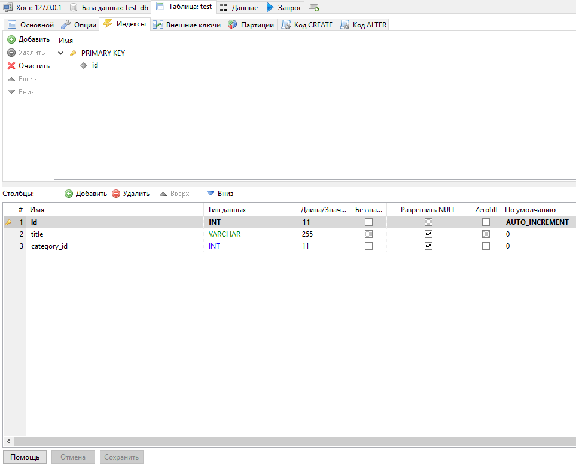
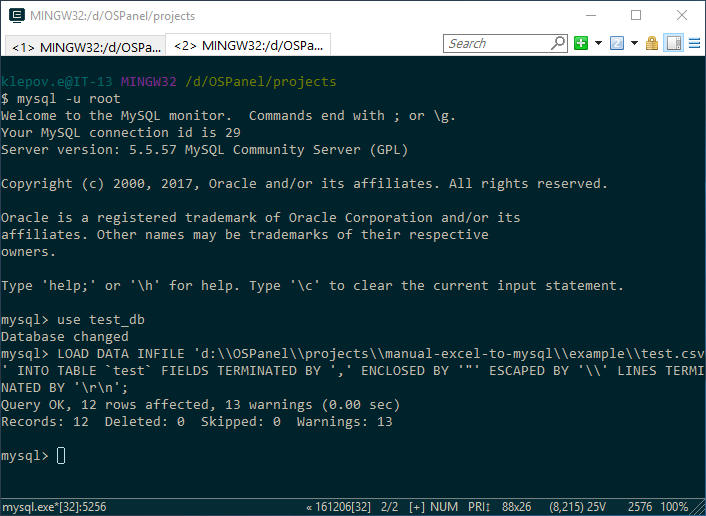

# Импорт excel в mysql
### 1. Выключить настройку у mysql "secure-file-priv" (my.cnf)
``` ini
[mysqld]
secure-file-priv = ""
```
### 2. Создать таблицу, со структурой идентичной данным в excel файле

### 3. Сохранить файл в формате csv
### 4. Залогониться в консоли
```bash
 mysql -u root
```
выбрать базу
```mysql
 use test_db
```
и загрузить файл, где c:\\path-to-file.csv - путь до файла, а table_name - название таблицы в которую будет производиться импорт
```mysql
LOAD DATA INFILE 'c:\\path-to-file.csv' INTO TABLE `table_name` FIELDS TERMINATED BY ',' ENCLOSED BY '"' ESCAPED BY '\\' LINES TERMINATED BY '\r\n';
```
